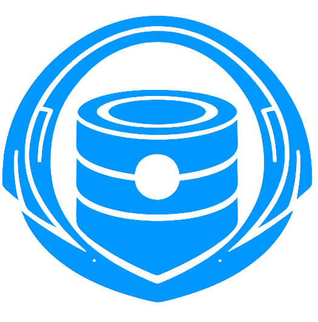

<p align="center">
  <i>"it's not perfect, but it works (i guess)"</i>
</p>

<p align="center">
  
</p>

<h1 align="center">The Last Archive</h1>

<p align="center">
  <strong>A high-performance, local-first search and archival engine powered by RAG.</strong><br>
  <i>This is a completely open-source project dedicated to knowledge preservation and semantic search.</i>
</p>

<p align="center">
  <a href="#key-features">Features</a> •
  <a href="#quick-start">Quick Start</a> •
  <a href="#architecture">Architecture</a> •
  <a href="#tech-stack">Tech Stack</a> •
  <a href="#license">License</a>
</p>

---

## Overview
**The Last Archive** is an integrated solution for private web archival and semantic search. It empowers users to crawl, index, and interact with web content through a unified interface, leveraging Large Language Models (LLMs) and vector search technology—all while maintaining complete data sovereignty on local infrastructure.

## Key Features
*   **Privacy-First RAG**: Context-aware intelligence using your personal archives without external API dependencies.
*   **Semantic Retrieval**: Advanced vector-based search that understands intent beyond simple keywords.
*   **Modular Microservices**: Dockerized components that communicate over a unified internal network.
*   **Local-First Design**: Engineered to run entirely offline, ensuring data privacy and fast response times.
*   **Hybrid Storage**: Combines relational metadata (SQLite) with vector embeddings (Qdrant).
*   **Ethical Archival**: Built-in support for `robots.txt` compliance and controlled crawl rates.

## Architecture
The platform is engineered as a distributed system of specialized microservices to ensure modularity and performance:

*   **Spider (Go)**: A high-concurrency web crawler capable of archiving complex site structures, including HTML, images, and PDF documents.
*   **Embedding Service (Python)**: Utilizes state-of-the-art transformer models to generate high-dimensional vector representations of text.
*   **Llama-Go (Go)**: A high-performance bridge for Ollama, providing OpenAI-compatible LLM inference endpoints.
*   **Search Server (Node.js)**: The central orchestration layer that manages the API, coordinates between services, and handles persistent storage.
*   **Frontend (Next.js)**: A premium, responsive user interface built with React 19 and Tailwind CSS.
*   **Qdrant**: A robust vector database used for semantic similarity search and high-speed retrieval.

## Tech Stack
| Component | Technology |
| :--- | :--- |
| **Frontend** | Next.js 16, React 19, Radix UI, Tailwind CSS |
| **Primary API** | Node.js (Express), Better-SQLite3 |
| **Logic/Crawling** | Go 1.25 |
| **AI Inference** | Python (PyTorch/Transformers), Ollama |
| **Vector Engine** | Qdrant |

---

## Quick Start
The easiest way to get started is using the provided CLI tools for your platform.

### Prerequisites
*   [Docker](https://www.docker.com/) and [Docker Compose](https://docs.docker.com/compose/)
*   [Ollama](https://ollama.com/) (For local LLM hosting)
*   [Go 1.21+](https://golang.org/) (Required for local crawler execution)

### 1. Initialize & Start Services
Use the CLI to create the internal network and launch all microservices:

**Linux/macOS:**
```bash
chmod +x archive.sh
./archive.sh up
```

**Windows:**
```powershell
.\archive.ps1 up
```

### 2. Seed the Archive
Once the services are active, use the CLI to add your first websites to the index:

**Linux/macOS:**
```bash
./archive.sh crawl
```

**Windows:**
```powershell
.\archive.ps1 crawl
```

### 3. Access the Interface
Open your browser and navigate to:
*   **Web UI**: [http://localhost:3000](http://localhost:3000)
*   **API Health**: [http://localhost:1213/api/health](http://localhost:1213/api/health)

---

## Configuration
Key environment variables used across the services (managed via `.env` files in each service directory):

| Variable | Description | Default Target |
| :--- | :--- | :--- |
| `LLAMA_BASE_URL` | Endpoint for the LLM bridge | `http://llm-server:1410` |
| `EMBEDDING_BASE_URL` | Endpoint for the embedding service | `http://embedding-service:5050` |
| `QDRANT_HOST` | Hostname for the Qdrant database | `qdrant` |
| `QDRANT_API_KEY` | Authentication key for Qdrant | `REQUIRED` |
| `PORT` | Listening port for the search server | `1213` |

## Repository Structure
```text
.
├── frontend            # Next.js web application
├── server              # Node.js API Orchestrator (Express + SQLite)
├── spider              # Go-based high-concurrency crawler
├── llama-go            # Go bridge for Ollama inference
├── embedding_service   # Python-based embedding generation
├── qdrant              # Vector storage configuration
├── archive.sh          # Linux/macOS CLI tool
└── archive.ps1         # Windows PowerShell CLI tool
```

---

## Contributing
We welcome contributions to **The Last Archive**! Whether it's reporting a bug, suggesting a feature, or submitting a pull request, your help is appreciated.

1.  Fork the repository.
2.  Create your feature branch (`git checkout -b feature/AmazingFeature`).
3.  Commit your changes (`git commit -m 'Add some AmazingFeature'`).
4.  Push to the branch (`git push origin feature/AmazingFeature`).
5.  Open a Pull Request.

## License
This project is licensed under the **MIT License**. See the [LICENSE](LICENSE) file for the full text.

## Disclaimer
**The Last Archive** is provided as-is for educational and personal archival purposes. 
*   **Ethical Crawling**: This tool is designed to respect `robots.txt` rules. Users are responsible for ensuring their usage complies with the terms of service of any websites they archive.
*   **Liability**: The authors and contributors are not responsible for any misuse of this tool, including but not limited to unauthorized data scraping, copyright infringement, or any legal consequences arising from the use of this software.

---
<p align="center">
  <i>Built for privacy, search, and the preservation of knowledge.</i>
</p>
